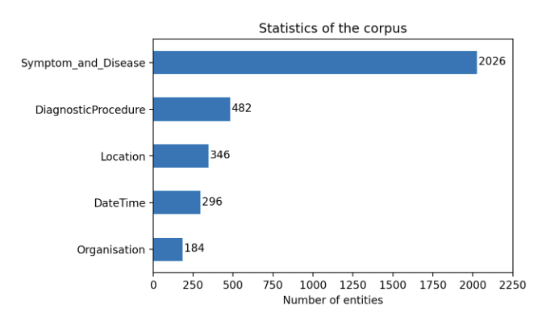

# A Vietnamese Biomedical Named Entity Recognition Corpus

## Context

VietBioNER is constituted by biomedical grey literature specified for tuberculosis.
The corpus was annotated with five named entity categories of Organisation, Location, Date and Time, Symptom and Disease, and Diagnostic Procedure.

The construction of VietBioNER and some baseline performance are detailed in our LREC 2022 paper:

```bibtex
@inproceedings{vietbioner,
    title = "{A Named Entity Recognition Corpus for Vietnamese Biomedical Texts to Support Tuberculosis Treatment}",
    author = "Phan, Uyen and Nguyen, Phuong and Nguyen, Nhung",
    booktitle = "Proceedings of the 13th Language Resources and Evaluation Conference",
    year = "2022",
    publisher = "European Language Resources Association"
}
```

## Entity Category Examples

| Entity Category         | Examples                                                                                  |
|:-------------------------:|-------------------------------------------------------------------------------------------|
| `Symptom_and_Disease` | `lao đa kháng thuốc` (multidrug-resistant tuberculosis), `ho có đờm` (coughing up phlegm) |
| `DiagnosticProcedure` | `AFB (+)`, `GeneXpert`                                                                    |
| `Location`            | `phía Bắc Việt Nam` (North Vietnam), `Khu vực Đông Nam Á` (Southeast Asia)                |
| `DateTime`            | `mùa hè` (summer), `từ 1990-1992` (from 1990-1992) |
| `Organisation`        | `Bộ Y tế` (Ministry of Health), `Khoa Phổi Thận` (Lung and Kidney Department)             |
## Content

The corpus contains 1706 sentences with an average length of 31 tokens.
About 74% of sentences in the corpus contained annotated entities, whose distribution among the five categories is detailed in Fig.1.

<div align="center">



*Figure 1: Distribution of each entity type in VietBioNER.*

</div>

### Supervised learning benchmark setting

The corpus is randomly split into three sets: training, validation, and test sets. These sets are constructed with an approximate ratio of 7:3:7. Specifically, the training set consists of 706 sentences, the validation set consists of 300 sentences, and the test set has 700 sentences.

The distribution of all entity categories in supervised learning setting is reported in Table 1.

|   Entity Category   | Train | Valid | Test |
|:-------------------:|:-----:|:-----:|:----:|
| Symptom_and_Disease |  838  |  378  |  810 |
| DiagnosticProcedure |  191  |   89  |  202 |
|       Location      |  162  |   78  |  106 |
|       DateTime      |  141  |   58  |  97  |
|     Organisation    |   77  |   36  |  71  |

*Table 1: Number of entities in each sets.*

Training, validation, and test files are available in the [data_supervised_learning](data_supervised_learning/) folder.

### Few-shot learning benchmark setting

We build `1-shot`, `5-shot`, and `10-shot` learning sets from the training set mentioned in supervised setting.
For each `n-shot` learning set, we generated 5 random support sets using the Greedy Sampling algorithm [(Yang and Katiyar, 2020)](https://aclanthology.org/2020.emnlp-main.516/). `n` denotes the number of entities in each category that are selected for inclusion in each support set. Consequently, each $n$-shot support set will have a maximum of `(n * num_entity_categories)` sentences.

The distribution of all entity categories in few-shot learning setting is reported in Table 2.

| **Entity Category** | **1-shot** | **5-shot** | **10-shot** |
|:-------------------:|:----------:|:----------:|:-----------:|
| Symptom_and_Disease |      5     |     20     |      35     |
| DiagnosticProcedure |      3     |      8     |      13     |
|       Location      |      4     |      8     |      17     |
|       DateTime      |      2     |      7     |      13     |
|     Organisation    |      2     |      6     |      11     |

*Table 2: Number of entities in each sets (average over 5 sets).*

$n$-shot sets are available in the [data_fewshot_learning](data_fewshot_learning/) folder. We can use the same test set as in the supervised setting.

### Original files with brat format

We also provide the original `.ann` files with brat format in the [data_brat](data_brat/) folder.

## License

This work is licensed under a
[Creative Commons Attribution 4.0 International License][cc-by].

[![CC BY 4.0][cc-by-image]][cc-by]

[cc-by]: http://creativecommons.org/licenses/by/4.0/
[cc-by-image]: https://i.creativecommons.org/l/by/4.0/88x31.png
[cc-by-shield]: https://img.shields.io/badge/License-CC%20BY%204.0-lightgrey.svg